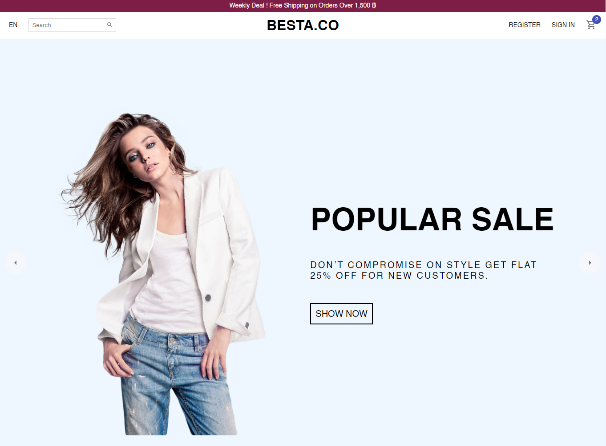
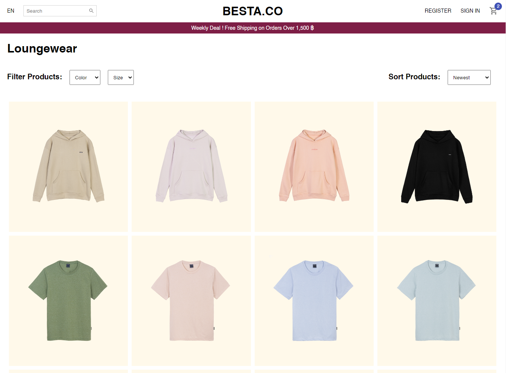
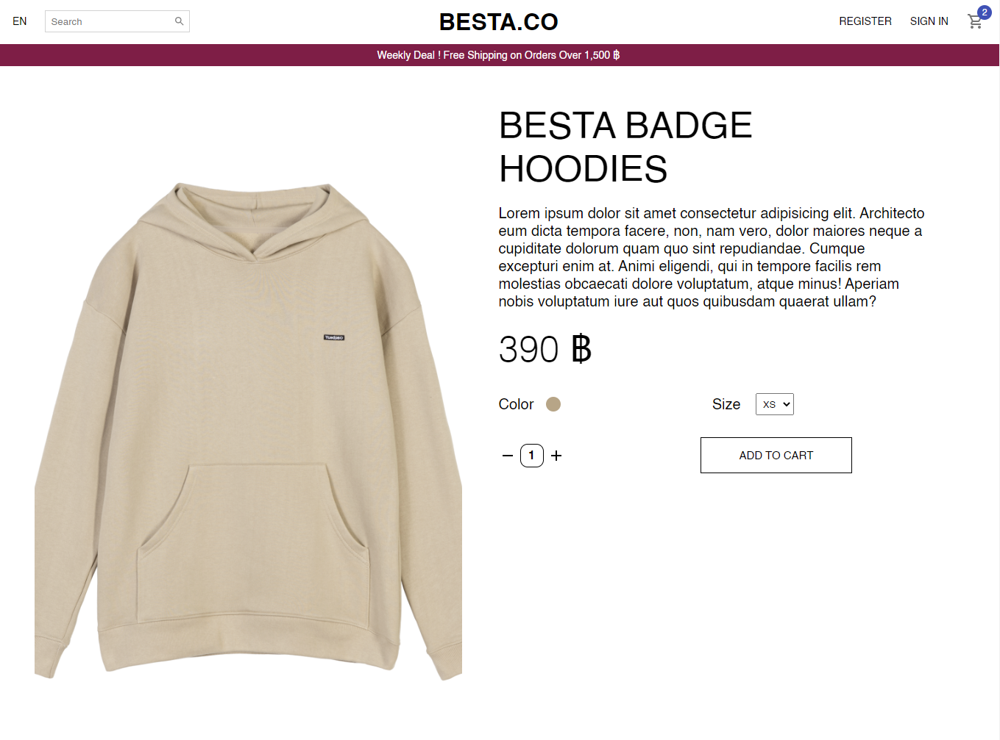
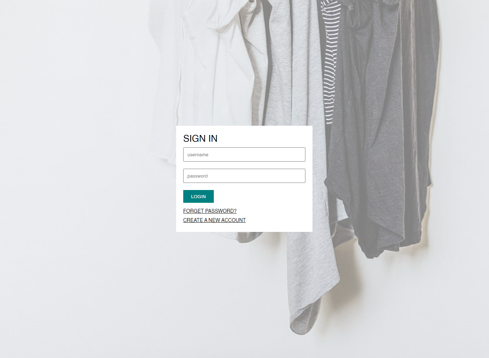
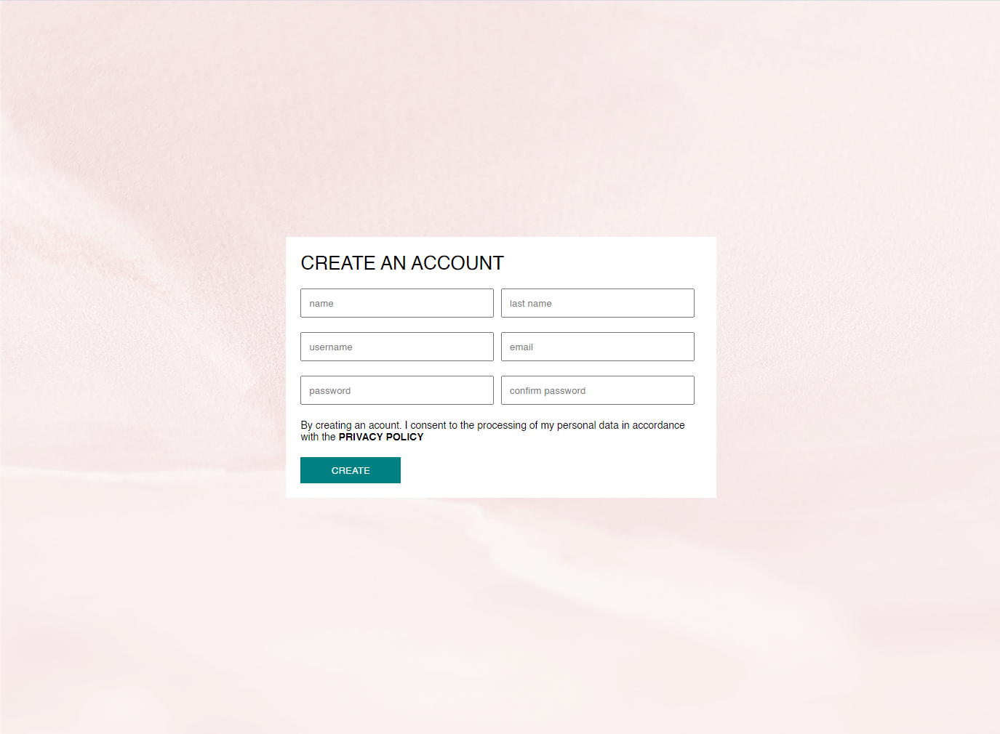
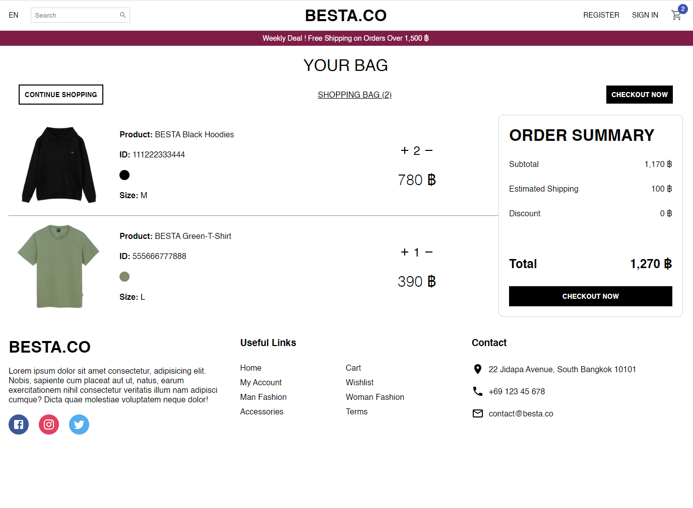

# Design and Development of Besta.Co the E-Commerce Website

**Design and Development of Besta.Co the E-Commerce Website** is project which is developed for using User Interface design tool to design prototypes and advanced frontend development concepts to develop website based on E-Commerce Business with responsive web design for supporting mobile devices using HTML, CSS, JavaScript, React JS, Material UI and Styled Components. 

This project is part of Senior Project in Information Technology for Business (ID : 2603496)

---

In the project directory, you must run these commands in terminal:

### `yarn` and `yarn start`

and open [http://localhost:3000](http://localhost:3000) to view it in the browser.

The project consists of 6 pages, you can change page through routes.
